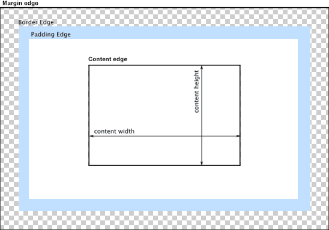

# 盒模型

#### 盒模型图示：

注意：outline 不是盒模型的一部分.

#### 盒子高度：
默认，宽高由 content area 决定。如下:

如果设置了 box-sizing:border-box，则由 border area 决定。如下:

#### 盒模型的z轴层级

<iframe width="100%" height="400" src="//jsfiddle.net/stonebreaker/tcpq6s8x/26/embedded/result,html,css/" frameborder="0"></iframe>

#### 盒模型相关属性

- **尺寸** - width / height / min- / max-
- **尺寸模型** - box-sizing
- **边框** - border
- **外边距** - margin
- **内边距** - padding
- **背景** - background
- **修饰** - box-shadow

参考：
1. https://developer.mozilla.org/en-US/docs/Web/CSS/CSS_Box_Model/Introduction_to_the_CSS_box_model
2. https://developer.mozilla.org/en-US/docs/Learn/CSS/Introduction_to_CSS/Box_model
3. https://www.w3.org/TR/CSS2/box.html
4. https://developer.mozilla.org/en-US/docs/Learn/CSS/Styling_boxes/Box_model_recap

<iframe width="100%" height="300" src="//jsfiddle.net/stonebreaker/L8t5mqgn/10/embedded/result,html/" allowfullscreen="allowfullscreen" allowpaymentrequest frameborder="0"></iframe>
