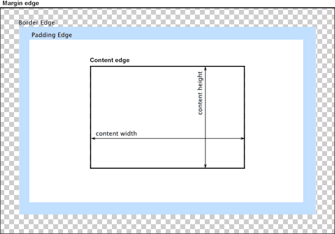

# 外边距 - margin

margin 设置盒子的外边距，是盒子的一部分。

如下图所示：

透明部分为 margin 所控制的区域，称做 **margin area**。

margin 的可选值有3个：
- 固定值
- 百分比(相对于width)
- auto

> 注意：
> 1. margin-top/margin-bottom在non-replaced的行内元素上无效，如 &lt;span&gt;、&lt;code&gt;等.
> 2. 对于块级元素，使用 margin: 0 auto，可使其水平居中。

参考：

https://developer.mozilla.org/en-US/docs/Web/CSS/margin
