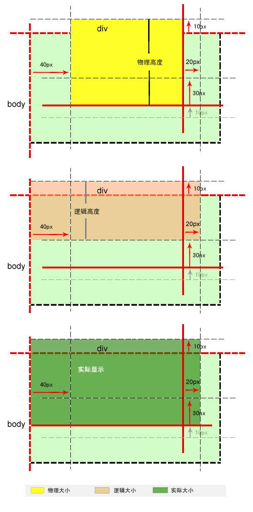

# 外边距重叠

margin外边距重叠指的是，**当两个垂直外边距相遇时(有可能是同辈或者后辈)，它们将合并成一个外边距**。

#### 边距重叠必要条件：
1. 必须是常规文档流(不是float和绝对定位)中的块级盒子，并且处于同一个BFC当中；
2. 没有行盒 - 即linebox(行盒由一行中所有的内联元素所组成)，没有padding和border将他们隔开；
3. 都属于垂直方向上相邻的外边距；

#### 边距重叠的几种情况：
1. 常规文档流中，一个盒子如果没有padding-top和border-top，那么这个盒子的上边距会和其内部文档流中的第一个子元素的上边距合并，但这个子元素不能包含clearance（样式中有clear：right|left|both）。下边距合并，同理。
2. 常规文档流中，一个盒子如果没有padding-bottom和border-bottom，那么这个盒子下边距会跟他的下一个兄弟盒子的的上边距合并，除非他们之间存在clearance。
3. 常规文档流中，一个盒子的高度为0并且最小高度也为0，且不包含常规文档流的子元素，并且自身没有建立新的BFC的，那么它自身的上边距和下边距会合并。

##### 示例
<iframe width="100%" height="850" src="//jsfiddle.net/stonebreaker/Lfq9na3r/47/embedded/result,css,html,js/" allowfullscreen="allowfullscreen" allowpaymentrequest frameborder="0"></iframe>

#### 根据上面的条件，不发生外边距重叠的情况有以下几种：
1. **水平方向** 上永远不会发生外边距合并。     

2. 垂直方向上，创建了新的 **BFC** 的元素与它的子元素的外边距不会重叠。（注意区别：BFC内部的子元素与子元素之间边距是会发生重叠）

3. 一个 **浮动** 的元素不与任何元素的外边距产生重叠，包括其父元素及子元素及兄弟元素。（分析：浮动元素脱离了常规文档流，且建立了BFC，他不会影响周围其他元素、也不会被其他元素影响）

4. **overflow 设置为 hidden|scroll|auto** 的元素不会与它的子元素的外边距重叠。（分析：overflow不是visible的元素建立了BFC，他不会影响周围其他元素、也不会被其他元素影响）

5. **绝对定位** 的元素不与任何元素的外边距产生重叠，包括其父元素及子元素及兄弟元素。（分析，脱离了常规文档流，且建立了BFC，他不会影响周围其他元素、也不会被其他元素影响）

6. **行内块级（inline-block）元素** 不与任何元素的外边距产生重叠，包括其父元素及子元素及兄弟元素。（分析：行内块级元素不符合发生边距重叠的第一个必要条件‘块级盒子’，块级盒子的display属性必须是以下三种之一：'block'， 'list-item'， 和 'table'）

#### 重叠后的外边距的高度计算规则：
1. 两个相邻的外边距都是正数时，重叠结果是它们两者之间较大的值
2. 两个相邻的外边距都是负数时，重叠结果是两者绝对值的较大值
3. 两个外边距一正一负时，重叠结果是两者相加的和。

#### 外边距重叠产生的影响

盒子的显示大小 = content + padding + border + 正 margin 值。

负的 margin 值不会影响 box 的实际大小，但是负的 margin-top 或 margin-left 值会引起 box 的向上或向左位置移动，如果是 margin-bottom 或 margin-right 只会影响下面 box 的显示的参考线。

如下图所示：给div元素设置 **margin:-10px 20px -30px 40px**（借鉴别人的例子）

参考：
https://developer.mozilla.org/en-US/docs/Web/CSS/CSS_Box_Model/Mastering_margin_collapsing
