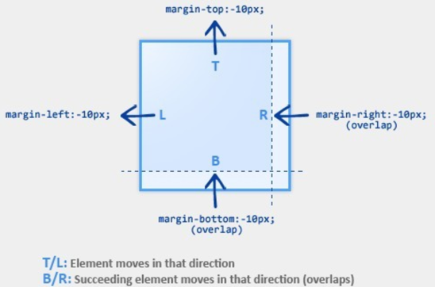

# 外边距负值的应用

负 margin 是CSS标准所允许的，它控制了 **当前元素离其相邻的元素有多么 '近'**。

负 margin 不会导致元素脱离文档流，如果使用负 margin 上移(左移)一个元素，则所有跟随的元素都会被上移(左移)。

> 所有现代浏览器都兼容负 margin。

如下图片所示，static元素使用负 margin：

对于 static 元素:

**margin-top / margin-left 为负数时，元素将被拉进指定的方向。**

**margin-bottom / margin-right 为负数时，其后续的元素将会被拉向指定的方向，覆盖当前元素。**

##### 示例：水平垂直居中\(适合固定宽高的元素\)

<iframe width="100%" height="400" src="//jsfiddle.net/stonebreaker/2heyj0bv/13/embedded/result,html,css/" allowfullscreen="allowfullscreen" allowpaymentrequest frameborder="0"></iframe>

##### 示例：列表项两端对齐

<iframe width="100%" height="200" src="//jsfiddle.net/stonebreaker/afu06sdz/7/embedded/result,html,css/" allowfullscreen="allowfullscreen" allowpaymentrequest frameborder="0"></iframe>

##### 示例：三栏自适应布局
<iframe width="100%" height="300" src="//jsfiddle.net/stonebreaker/7a4e8mo9/13/embedded/result,html,css/" allowfullscreen="allowfullscreen" allowpaymentrequest frameborder="0"></iframe>

通过对三栏全部设置左浮动，使他们处于同一个文档流，再用margin负值调整位置。

##### 示例：三栏等高布局

<iframe width="100%" height="300" src="//jsfiddle.net/stonebreaker/1386grbf/28/embedded/result,html,css/" allowfullscreen="allowfullscreen" allowpaymentrequest frameborder="0"></iframe>

此例关键是给每个框设置大的底部内边距，然后用数值相似的负外边距消除这个高度。这会导致每一列溢出容器元素，如果把外包容器的overflow属性设为hidden，列就在最高点被裁切。

##### 示例：选项卡等边框线的处理
<iframe width="100%" height="300" src="//jsfiddle.net/stonebreaker/yp6js4q0/17/embedded/result,html,css,js/" allowfullscreen="allowfullscreen" allowpaymentrequest frameborder="0"></iframe>
