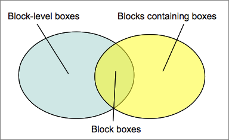

# Visual Formatting Model

The CSS visual formatting model is **an algorithm that processes a document and displays it on visual media**.
This model is a basic concept of CSS.

The visual formatting model **transforms each element of the document and generates zero, one, or several boxes that conform to the CSS box model**.

The layout of each box is defined by:

- **The dimensions of the box**: precisely defined or constrained, or not.
- **The type of box**: inline, inline-level, atomic inline-level, block.
- **The positioning scheme**: in the normal flow, a float, or absolute positioning.
- **The other elements in the tree**: its children and neighbors.
- **The viewport size and position**.
- Intrinsic dimensions of contained images.
- Other external information.

The model renders a box, in relation to the edge of its containing block. **Usually, a box establishes the containing block for its descendants**. However, a box is not constrained by its containing block; when a box's layout goes outside the containing block, it is said to overflow.

### Box generation
Box generation is the part of the CSS visual formatting model that creates boxes from the document's elements. **Generated boxes are of different types**, which affect how the visual formatting is done. The type of the box generated depends on the value of the display CSS property.

#### Block-level elements and block boxes
An element is said to be block-level when the calculated value of its display CSS property is: **block, list-item, or table**. A block-level element is visually formatted as a block (e.g., paragraph), intended to be vertically stacked.

**Each block-level box participates in a block formatting context(一个Block Level Box关联一个BFC)**.

Each block-level element generates at least one block-level box, called the principal block-level box.

Some elements, like a list-item element, generating further boxes to handle bullets and other typographic elements introducing the list item, may generate more boxes. Most generate only the principal, block-level box.(每个 Block-Level 元素至少产生一个 Block-Level Box，叫做 Principal Box;)

The principal block-level box contains descendant-generated boxes and generated content. It is also the box involved in the positioning scheme.

A block-level box may also be a block container box. **A block container box is a box that contains only other block-level boxes, or creates an inline formatting context, thus containing only inline boxes**.

It is important to note that the notions of a block-level box and block container box are disjointed. The first, describes how the box behaves with its parents and sibling. The second, how it interacts with its descendants. Some block-level boxes, like tables, aren't block container boxes. Reciprocally, some block container boxes, like non-replaced inline blocks and non-replaced table cells, aren't block-level boxes.

Block-level boxes that also are block container boxes are called block boxes.

#### Anonymous block boxes
In some cases, the visual formatting algorithm needs to add supplementary(补充的) boxes. Because CSS selectors cannot style or name these boxes, they are called **anonymous boxes**.

Because selectors do not work with anonymous boxes, they cannot be styled via a stylesheet. This means that all inheritable CSS properties have the inherit value, and all non-inheritable CSS properties, have the initial value.

Block containing boxes contain only inline-level boxes or only block-level boxes. But often the document contains a mix of both. In that case, anonymous block boxes are created around adjacent(邻近的) inline-level boxes.

参考：
https://developer.mozilla.org/en-US/docs/Web/CSS/Visual_formatting_model
