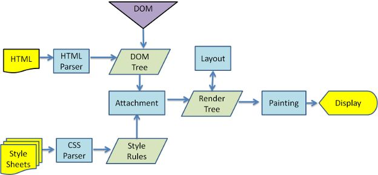

# 关于选择器 

#### 为什么选择器不能子选父

看看如下几个选择器：

1. **child &lt; parent** : 选择元素的直接父元素，跟 parent &gt; child 选择直接子元素对应。

2. **child ^ ancestors** : 选择元素的祖先们。

3. **A - B** : 选择A前面的B，即A.prev\(\)；与 A + B 选择A后面的B对应。

目前CSS没有这样的选择器，是因为**这样的选择器会导致回溯**。

浏览器最初设计的时候就考虑了**渐进显示**，即整个文档加载了多少内容就显示多少内容，而不用等待整个文档下载完。

渐进显示在CSS上的原理就是**一个节点所适用的样式只取决于它和它之前的节点（父节点、它之前的兄弟节点）的性质**。

而上述那些 selector 则恰好相反，也就是 **当浏览器解析到一个新节点时，可能改变之前节点所使用的样式——因而要求在解析一个新节点后，得回头重新计算之前节点所匹配的样式，此即所谓“回溯”** 。在最坏的情况下所导致大量的重新计算和reflow，可以相当于重新render整个网页。

所以 CSS 直到2.1都没有任何可能引起回溯的 selector。但是selector 3就开了口子。比如: **last-child**。考虑如下规则：

```CSS
div:last-child {
	display:none
}
```

CSS2 的所有 selector 在 &lt;div attributes&gt; 的 start tag 结束后就确定是否匹配了，但是对于 **:last-child** 伪类，要判断这条规则是否适用，至少是在 &lt;/div&gt; 之后再读入一个 tag 才行（是父元素的end tag则匹配，反之不匹配）。假设一个div是整个页面的container，那么就导致在页面没有加载完时能看见div（前提是浏览器已经渐进显示了部分内容），而在加载完后就看不见了。

类似的，考虑 **x:empty** ，比 :last-child 好点，在解析到 &lt;/x&gt; 时就可以确定了，而不用再读一个tag。

而 **:nth-last-child\(\)** 则就比 :last-child 要更困难，得等整个父元素结束。


#### 为什么是从右向左解析选择器的

首先我们要看一下选择器的「解析」是在何时进行的。



HTML 经过解析生成 **DOM Tree**；而在 CSS 解析完毕后，需要将解析的结果与 DOM Tree 的内容一起进行分析建立一棵 **Render Tree**，最终用来进行绘图。

Render Tree 中的元素（WebKit 中称为「renderers」，Firefox 下为「frames」）与 DOM 元素相对应，但非一一对应：一个 DOM 元素可能会对应多个 renderer，如文本折行后，不同的「行」会成为 render tree 中不同的 renderer。也有的 DOM 元素被 Render Tree 完全无视，比如 display:none 的元素。

在建立 Render Tree 时（WebKit 中的「Attachment」过程），浏览器就要为每个 DOM Tree 中的元素根据 CSS 的解析结果（Style Rules）来确定生成怎样的 renderer。**对于每个 DOM 元素，必须在所有 Style Rules 中找到符合的 selector 并将对应的规则进行合并**。选择器的「解析」实际是在这里执行的，在遍历 DOM Tree 时，从 Style Rules 中去寻找对应的 selector。

因为所有样式规则可能数量很大，而且绝大多数不会匹配到当前的 DOM 元素（因为数量很大所以一般会建立规则索引树），所以有一个快速的方法来判断「这个 selector 不匹配当前元素」就是极其重要的。

如果正向解析，例如「div div p em」，我们首先就要检查当前元素到 html 的整条路径，找到最上层的 div，再往下找，如果遇到不匹配就必须回到最上层那个 div，往下再去匹配选择器中的第一个 div，回溯若干次才能确定匹配与否，效率很低。

**逆向匹配则不同，如果当前的 DOM 元素是 div，而不是 selector 最后的 em，那只要一步就能排除。只有在匹配时，才会不断向上找父节点进行验证。**

但因为匹配的情况远远低于不匹配的情况，所以逆向匹配带来的优势是巨大的。

同时我们也能够看出，在选择器结尾加上「\*」就大大降低了这种优势，这也就是很多优化原则提到的尽量避免在选择器末尾添加通配符的原因。
